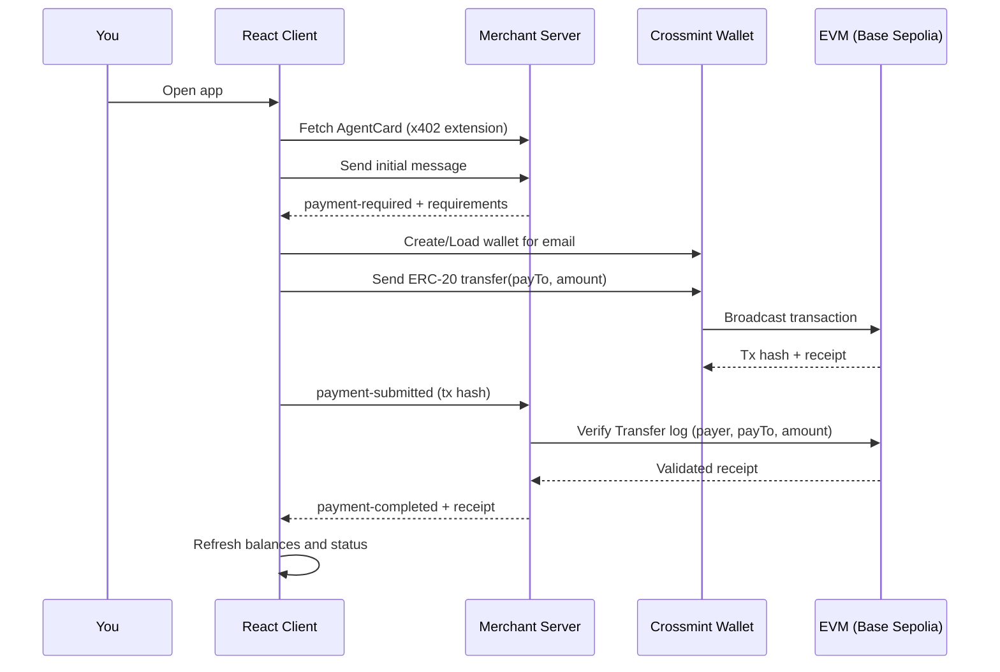

# A2A x402 Payment Demo with Crossmint

Run a complete Agent-to-Agent (A2A) payment flow using the x402 payments extension and the Crossmint Wallets SDK in a single React web app plus a tiny merchant server.

[](https://www.youtube.com/watch?v=Esoqx7SWqaI)


## What it does

### Server (merchant)
- Advertises the x402 extension via its AgentCard, replies to the first client message with payment requirements (`x402.payment.required`), verifies payment using the `direct-transfer` scheme by reading ERC‑20 `Transfer` logs on-chain, and then publishes a receipt with the transaction hash when everything matches.

### Client (React app)
- Presents a simple UI for the A2A flow, uses Crossmint Wallets to create/load the payer wallet, sends an ERC‑20 `transfer` from that wallet, submits the tx hash back over x402, and live-updates balances and status once the server confirms.

### Sequence Flow


## Quick start

### Prerequisites
- Node.js 18+ and npm
- A `.env` file with your Crossmint credentials (template provided)

### 1) Setup environment
```bash
# Copy template and fill in values
cp env.example .env
```

- `RPC_URL`: RPC URL for the merchant server to connect to
- `MERCHANT_ADDRESS`: the merchant payee address (required)
- `ASSET_ADDRESS` (optional): defaults to USDC on Base Sepolia `0x036CbD53842c5426634e7929541eC2318f3dCF7e`
- `X402_NETWORK` (optional): defaults to `base-sepolia`

### 2) Install dependencies
```bash
npm install
```

### 3) Start both services
```bash
# Terminal 1: merchant server (port 10000)
npm run server

# Terminal 2: React client (port 3000)
npm run dev
```

### 4) Open the demo
- React App: http://localhost:3000
- Server API: http://localhost:10000
- AgentCard: http://localhost:10000/.well-known/agent-card.json

## Note
- Crossmint is the payer in this demo. You do not need a user private key; the Crossmint wallet service signs and sends the transfer, and the server verifies it on-chain. The merchant config only requires `MERCHANT_ADDRESS`.

## Getting testnet tokens
- Base Sepolia USDC: use the Circle Faucet at [https://faucet.circle.com/](https://faucet.circle.com/) and send to your Crossmint wallet address.

## 📋 Scripts

```bash
npm run server    # Start merchant server (port 10000)
npm run dev       # Start React client (port 3000)
```

## What's happening behind the scenes

- Discovery and activation: the client opts in to the payments extension and loads the merchant's AgentCard using the `X-A2A-Extensions` header. See `A2AClient.fromCardUrl` and `fetchWithExtension` in `app/page.tsx`.
- Request and requirements: the client sends an initial message; the merchant replies with a Task whose message `metadata` includes `x402.payment.status: "payment-required"` and `x402.payment.required`. See `handlePayment()` in `app/page.tsx`.
- Wallet setup (payer): a Crossmint wallet is created/loaded for `email:{userEmail}` on the requested chain. See `createCrossmint`, `CrossmintWallets.from`, and `wallets.createWallet` in `app/page.tsx`.
- Direct transfer: the client executes ERC‑20 `transfer(payTo, amount)` from the Crossmint wallet. See `evmWallet.sendTransaction` usage in `handlePayment()`.
- Payment submission: the tx hash and details are sent back with `x402.payment.status: "payment-submitted"` and `x402.payment.payload`.
- Server verification: the server checks the receipt and `Transfer` log for exact payer, payTo, and amount, then publishes `payment-completed` with a receipt. See `server.js`.
- Receipts and balances: the client reads `x402.payment.receipts` and refreshes balances via RPC + ERC‑20 calls. See `checkBalances()` in `app/page.tsx`.

## References

- [A2A JavaScript SDK](https://github.com/a2aproject/a2a-js)
- [Crossmint Wallets SDK](https://www.npmjs.com/package/@crossmint/wallets-sdk)
- [Local integration spec (direct-transfer)](./spec.md)
- [EIP-3009: Transfer With Authorization](https://eips.ethereum.org/EIPS/eip-3009)
