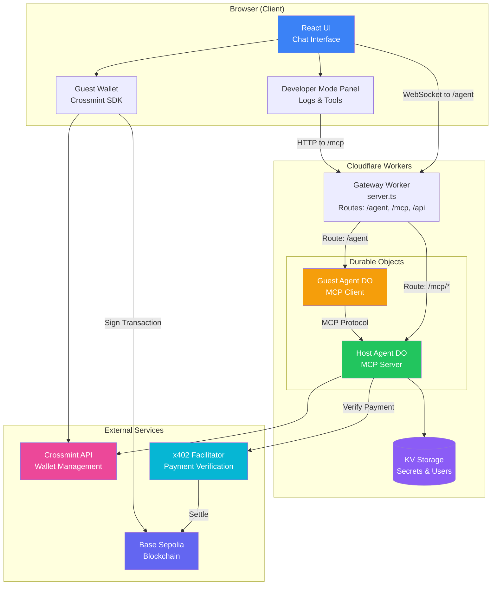
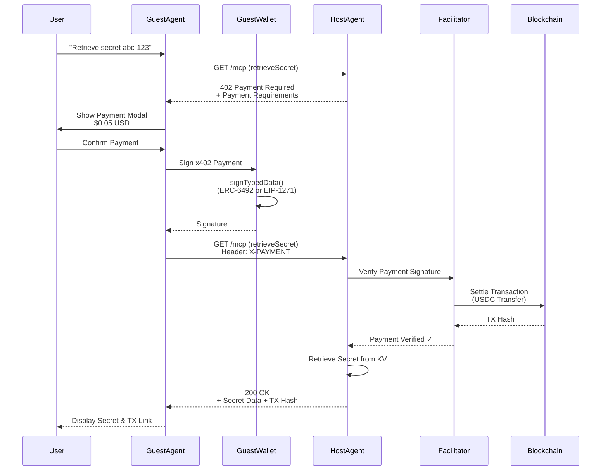
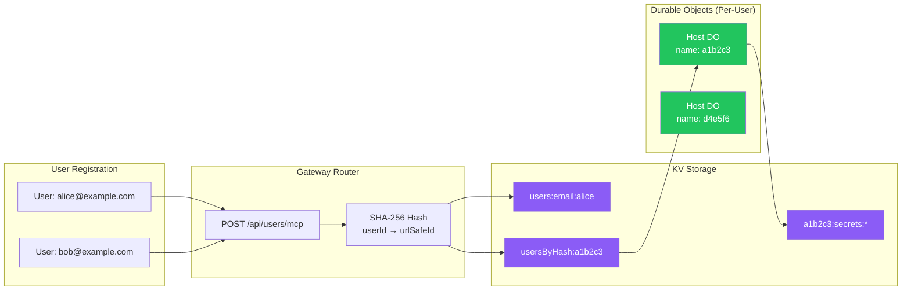
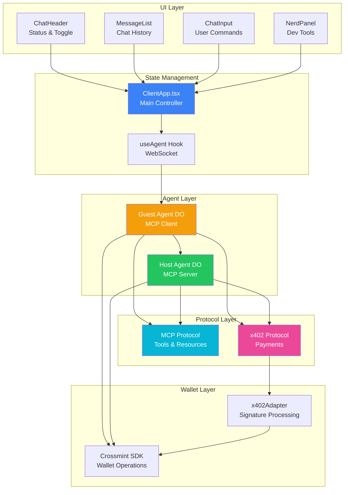
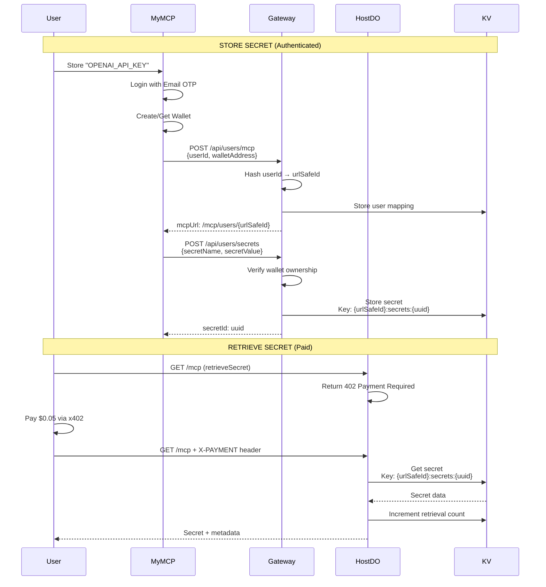
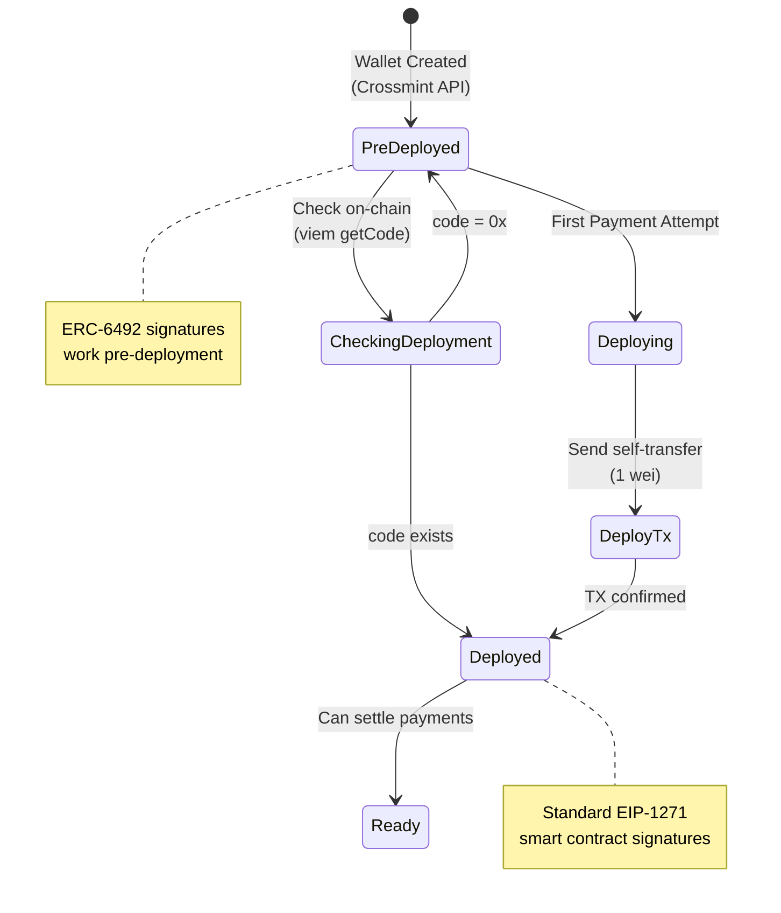
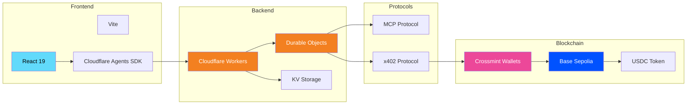
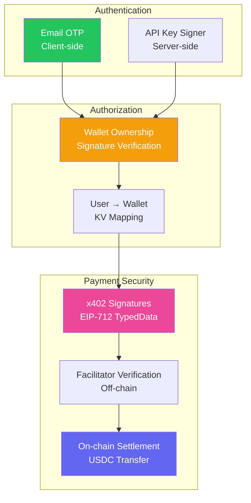

# Secret Vault MCP - Architecture Diagram

## What is a Durable Object?

**Durable Objects** are Cloudflare's solution for **stateful, coordinated serverless computing**. Think of them as:

### Simple Definition
A **single-threaded, persistent mini-server** that exists for as long as needed, with guaranteed data consistency.

### Key Characteristics

1. **Single Instance per ID**
   - Each Durable Object has a unique name/ID
   - Only ONE instance exists globally for that ID
   - Example: `Host DO name: "a1b2c3"` - there's only one of these worldwide

2. **Stateful & Persistent**
   - Has in-memory state that persists across requests
   - Can store data in built-in transactional storage
   - Survives between requests (unlike Workers which are stateless)

3. **Single-Threaded (Coordination)**
   - All requests to the same DO are serialized
   - No race conditions or concurrency issues
   - Perfect for things that need coordination (like chat rooms, game servers, or MCP agents)

4. **Geographically Distributed**
   - Automatically created near users who access them
   - Low latency for regional users
   - Can migrate between data centers based on usage

### In This Application

```
Guest Agent DO (name: "default")
├── Purpose: WebSocket connection handler
├── State: Current MCP connection, wallet info, pending confirmations
├── Created: On first browser connection
├── Lifecycle: Lives as long as browser is connected
└── Instance Count: 1 (all users share this for demo purposes)

Host Agent DO (name: "a1b2c3" - hashed from userId)
├── Purpose: MCP server exposing secret tools
├── State: User's wallet address, tool registry
├── Created: Lazily on first access to /mcp/users/a1b2c3
├── Lifecycle: Lives as long as needed, hibernates when idle
└── Instance Count: 1 per user (isolated per-user MCP servers)
```

### "Creating an MCP" = Creating a Route, Not a DO

**Important**: When you call `POST /api/users/mcp`, you're NOT creating the Durable Object directly. You're creating:

1. **A mapping in KV storage** (userId → urlSafeId → walletAddress)
2. **An MCP URL** that will route to a DO (e.g., `/mcp/users/a1b2c3`)

The **actual Durable Object** is created by Cloudflare **on first access** to that URL:

```
POST /api/users/mcp           → KV mapping created ✓
                                  DO doesn't exist yet ✗

GET /mcp/users/a1b2c3         → Cloudflare creates DO ✓
  (first access)                  DO.init() runs
                                  Wallet created
                                  MCP tools registered
```

This is called **lazy initialization** - DOs are created on-demand, not upfront.

### Lifecycle: Created → Active → Hibernated → Evicted

**Important**: Durable Objects don't live forever in memory. They have a lifecycle:

```
1. CREATED (on first access)
   └─> DO instance spins up
   └─> init() method runs
   └─> In-memory state initialized

2. ACTIVE (while receiving requests)
   └─> Processes requests
   └─> Maintains in-memory state
   └─> Writes important data to DO storage

3. HIBERNATED (no requests for ~10 seconds)
   └─> WebSocket connections kept alive
   └─> In-memory state persists
   └─> Wakes instantly on new request

4. EVICTED (idle for extended period)
   └─> In-memory instance destroyed
   └─> Durable storage persists ✓
   └─> Next request creates fresh instance
   └─> init() runs again
   └─> Loads state from DO storage
```

### What Persists vs What Doesn't

| Type | Persists After Eviction? | Example |
|------|-------------------------|---------|
| **DO Storage** | ✅ YES (forever) | User settings, data written via `storage.put()` |
| **In-Memory State** | ❌ NO | Variables like `this.wallet`, `this.mcpConnected` |
| **WebSocket Connections** | ❌ NO | Browser needs to reconnect |
| **KV Data** | ✅ YES (independent) | User mappings, secrets |

### In This Application

**Host Agent DO** stores critical data in KV (not DO storage):
- User wallet address → in KV
- Secrets → in KV
- MCP URL mappings → in KV

This means:
- Host DO can be evicted safely
- On next access, it recreates from KV
- No data loss

**Guest Agent DO** is more ephemeral:
- WebSocket connection is the main state
- When browser disconnects, DO can be evicted
- Next connection creates fresh instance

### Durable Objects vs Regular Workers

| Feature | Worker | Durable Object |
|---------|--------|----------------|
| **State** | Stateless | Stateful |
| **Instances** | Many (load balanced) | One per ID |
| **Concurrency** | Parallel requests | Serialized requests |
| **Use Case** | HTTP API, static content | Chat, coordination, agents |
| **Storage** | External (KV, R2, D1) | Built-in transactional storage |
| **WebSockets** | No* | Yes (perfect for it) |

*Workers can proxy WebSockets to Durable Objects

### Why Use DOs for Agents?

In this app, Durable Objects are perfect because:

1. **Agent State**: Each agent needs to maintain state (wallet, MCP connection, pending payments)
2. **WebSocket**: Guest DO handles the WebSocket connection from browser
3. **Isolation**: Each user's Host DO is completely isolated
4. **Coordination**: MCP protocol requires coordinated request/response handling

### How They're Created

```typescript
// server.ts
export { Host, Guest };  // Export DO classes

// wrangler.toml
[durable_objects]
bindings = [
  { class_name = "Host", name = "Host" },
  { class_name = "Guest", name = "Guest" }
]

// Accessing a DO
const agent = await getAgentByName(env.Guest, "default");
const response = await agent.fetch(request);
```

---

## System Architecture



## Payment Flow (x402 Protocol)



## MCP Server Architecture (Per-User Isolation)



## Component Interaction Map



## Data Flow: Store & Retrieve Secret



## Wallet Deployment Flow



## Technology Stack



## Key Features

### 1. **Autonomous Payments**
- Guest Agent automatically handles 402 responses
- No user intervention for payment signing
- Crossmint smart wallets abstract private key management

### 2. **Per-User Isolation**
- Each user gets their own Durable Object instance
- Secrets scoped by hashed userId
- Isolated wallet and payment history

### 3. **MCP Protocol Integration**
- Host exposes tools via MCP
- Guest consumes tools via MCP
- x402 layer adds payment requirements

### 4. **Smart Wallet Features**
- Pre-deployed wallets (ERC-6492 signatures)
- Auto-deployment on first payment
- EIP-1271 signature validation

### 5. **Developer Experience**
- Real-time logs in Developer Mode panel
- Transaction history tracking
- WebSocket-based agent communication
- Chat-based UI for natural interaction

## Security Model



---

## File Structure Map

```
calendar-concierge/
├── src/
│   ├── agents/
│   │   ├── host.ts          # MCP Server (Durable Object)
│   │   └── guest.ts         # MCP Client (Durable Object)
│   │
│   ├── components/
│   │   ├── Chat/
│   │   │   ├── ChatHeader.tsx
│   │   │   ├── MessageList.tsx
│   │   │   ├── ChatInput.tsx
│   │   │   └── Message.tsx
│   │   │
│   │   ├── NerdMode/
│   │   │   └── NerdPanel.tsx
│   │   │
│   │   └── TransactionHistory.tsx
│   │
│   ├── pages/
│   │   └── MyMcp.tsx        # User registration & secret storage
│   │
│   ├── utils/
│   │   ├── intentDetection.ts
│   │   └── exportUtils.ts
│   │
│   ├── shared/
│   │   └── secretService.ts  # KV-backed secret CRUD
│   │
│   ├── client.tsx           # Main React app
│   ├── server.ts            # Cloudflare Worker entry
│   ├── x402Adapter.ts       # Crossmint → x402 bridge
│   ├── constants.ts         # Network config
│   └── types.ts             # TypeScript types
│
├── wrangler.toml            # Cloudflare config
└── package.json
```
