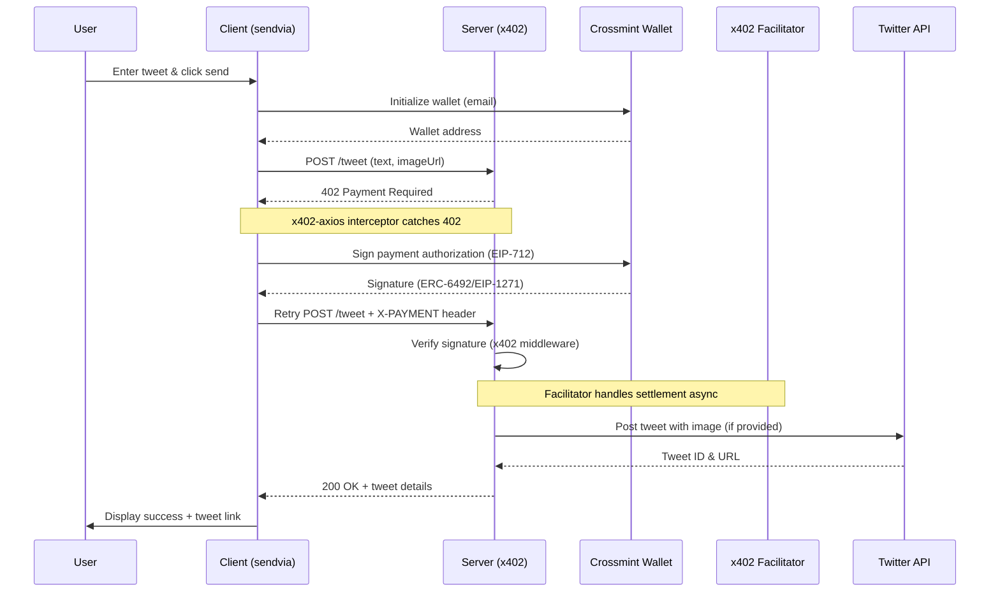

# x402 Tweet Agent

A unified Next.js application that posts tweets to X/Twitter for payment via the x402 protocol. The app uses Next.js middleware for payment validation, API routes for tweet posting, and a React frontend with Crossmint smart wallets for payment authorization. Settlement is handled by an external facilitator.

## Architecture

This is a **full-stack Next.js application** with:
- **Frontend**: React app with Crossmint wallet integration (`/`)
- **Middleware**: x402 payment validation using `x402-next`
- **API Routes**:
  - `/api/tweet` - Posts tweets (protected by x402 payment)
  - `/api/health` - Health check endpoint
- **Twitter Integration**: Server-side Twitter API v2 integration

## Prerequisites

- Node.js 18.0.0+
- Twitter Developer Account with API v2 access (Elevated tier, Read+Write permissions)
- Crossmint API key (client-side `sk_staging_*` or `sk_production_*`)
- Email address for wallet creation
- Base Sepolia testnet (default) or Base mainnet

## Installation

```bash
# Navigate to the Next.js app directory
cd sendvia

# Install dependencies
npm install
```

## Configuration

Create `.env.local` in the `sendvia` directory:

```bash
cd sendvia
cp env.example .env.local
```

**Required variables (in `sendvia/.env.local`):**

```bash
# Merchant wallet address for receiving payments
MERCHANT_ADDRESS=0x742d35Cc6634C0532925a3b844Bc9e7595f0bEb

# Twitter API credentials
TWITTER_CONSUMER_KEY=ABCxyz123...
TWITTER_CONSUMER_SECRET=ABCxyz123...
TWITTER_ACCESS_TOKEN=123-ABCxyz...
TWITTER_ACCESS_TOKEN_SECRET=ABCxyz123...

# x402 Configuration
X402_NETWORK=base-sepolia    # or 'base' for mainnet
PRICE_USDC=1                  # price per tweet in USDC
```

### Twitter API Setup

1. Create app at https://developer.x.com/en/portal/dashboard
2. Set app permissions to "Read and Write" (not "Read only")
3. Apply for "Elevated" access (required for v2 API tweet posting)
4. Generate API keys after setting permissions
5. Verify Twitter account has phone number attached
6. Copy all 4 credentials to `sendvia/.env.local`

## Running

**Development mode:**
```bash
npm run dev
```
App runs on http://localhost:3000

**Production build:**
```bash
npm run build
npm run start
```

## Usage

1. Open http://localhost:3000
2. Enter Crossmint API key (format: `sk_staging_*` or `sk_production_*`)
3. Enter email address
4. Click "Initialize Wallet" - creates Crossmint smart wallet
5. Enter tweet text (max 280 characters)
6. Optional: Enter image URL (must be publicly accessible)
7. Click "Send Tweet with x402 Payment"
8. Client signs payment authorization automatically
9. Server verifies signature and posts tweet
10. Response includes tweet ID and URL

## API Reference

### GET /api/health

Health check endpoint.

**Response (200):**
```json
{
  "status": "healthy",
  "timestamp": "2025-10-08T12:34:56.789Z",
  "network": "base-sepolia",
  "merchantAddress": "0x742d35Cc6634C0532925a3b844Bc9e7595f0bEb",
  "twitterConfigured": true,
  "endpoints": {
    "tweet": "$1"
  }
}
```

### POST /api/tweet

Posts tweet with payment verification (protected by x402 middleware).

**Authentication:** x402 payment protocol (EIP-712 signature)

**Price:** $1 USDC (configurable via `PRICE_USDC`)

**Headers:**
```
Accept: application/vnd.x402+json
Content-Type: application/json
X-PAYMENT: <signature> (added automatically by x402-axios on retry)
```

**Request:**
```json
{
  "text": "Hello world",
  "imageUrl": "https://example.com/image.jpg"
}
```

**Response (402) - First attempt without payment:**
```json
{
  "error": "Payment Required",
  "paymentDetails": {
    "amount": "1000000",
    "token": "USDC",
    "network": "base-sepolia",
    "merchant": "0x742d35Cc6634C0532925a3b844Bc9e7595f0bEb"
  }
}
```

**Response (200) - After payment verification:**
```json
{
  "success": true,
  "message": "Tweet sent successfully! Tweet ID: 1234567890123456789",
  "tweetId": "1234567890123456789",
  "tweetUrl": "https://twitter.com/user/status/1234567890123456789",
  "data": {
    "id": "1234567890123456789",
    "text": "Hello world"
  }
}
```

**Errors:**
- `400` - Missing or invalid tweet text
- `400` - Tweet exceeds 280 characters
- `401` - Twitter API authentication failed
- `402` - Payment required or verification failed
- `403` - Twitter API permission denied
- `429` - Twitter API rate limit exceeded
- `500` - Internal server error or Twitter API error

## Payment Flow



## Technical Architecture

**Next.js Middleware (`sendvia/middleware.ts`):**
- x402-next payment middleware for Next.js
- Validates EIP-712 signatures before allowing API access
- Configured for `/api/tweet` endpoint
- External facilitator handles on-chain settlement (https://x402.org/facilitator)

**API Routes (`sendvia/app/api/`):**
- `/api/tweet` - Twitter API v2 integration, posts tweets after payment verification
- `/api/health` - Health check and configuration status
- Server-side Twitter client with image download/upload support

**Frontend (`sendvia/app/page.tsx`):**
- React client with Crossmint smart wallet integration
- x402-axios interceptor for automatic payment handling
- localStorage persistence for configuration
- Real-time activity logging
- Input validation and accessibility features

**x402 Adapter (`sendvia/app/x402Adapter.ts`):**
- Converts Crossmint wallet to x402-compatible signer
- Handles ERC-6492 signatures (pre-deployed wallets)
- Handles EIP-1271 signatures (deployed wallets)
- Normalizes signature formats for verification

## Troubleshooting

**Error: `MERCHANT_ADDRESS is required`**
```bash
# Set merchant address in sendvia/.env.local
cd sendvia
echo "MERCHANT_ADDRESS=0x742d35Cc6634C0532925a3b844Bc9e7595f0bEb" >> .env.local
```

**Error: Twitter API 403 Permission Denied**
- Verify app has "Read and Write" permissions
- Regenerate access tokens after changing permissions
- Confirm account has "Elevated" access (not Basic)
- Ensure Twitter account has verified phone number

**Error: Twitter API 401 Authentication Failed**
- Verify all 4 credentials in `sendvia/.env.local` are correct
- Check for extra spaces, quotes, or newlines in values
- Regenerate tokens if credentials are old

**Error: Twitter API 429 Rate Limit**
- Wait 15 minutes before retrying
- Review Twitter API rate limits for your access tier
- Consider implementing exponential backoff

**Error: Payment verification failed**
- Check `X402_NETWORK` matches between client and server (default: base-sepolia)
- Verify `MERCHANT_ADDRESS` is valid Ethereum address
- Confirm Crossmint wallet initialized successfully
- Check browser console for x402 signer errors

**Error: Signature timeout with deployed wallets**
- Known issue: API key signer + deployed wallets experience timeouts
- Workaround: Use pre-deployed wallets (skip "Deploy Wallet" button)
- Pre-deployed wallets use ERC-6492 signatures which work reliably

**Error: Failed to download/upload image**
- Verify image URL is publicly accessible
- Check image size (Twitter supports max 5MB for photos)
- Ensure URL returns image content-type (JPEG, PNG, GIF, WebP)

**Error: CORS blocked request**
- CORS is handled automatically by Next.js (same-origin)
- API routes and frontend are on the same domain (localhost:3000)

## Dependencies

**Next.js Application (sendvia/):**
- next@^15.5.3 (Full-stack framework)
- react@^19.1.1 (Frontend)
- x402-next@^0.6.0 (Next.js payment middleware)
- x402-axios@^0.6.6 (Client-side payment interceptor)
- twitter-api-v2@^1.27.0 (Twitter API client)
- @crossmint/wallets-sdk@0.14.0 (Smart wallet integration)
- axios@^1.7.9 (HTTP client)
- viem@^2.38.0 (Ethereum utilities)
- dotenv@^17.2.2 (Environment variables)

## File Structure

```
send-tweet/
├── package.json             # Root package (runs sendvia scripts)
├── server.js                # Legacy A2A server (not used in main flow)
├── sendvia/                 # Next.js full-stack application
│   ├── middleware.ts        # x402-next payment middleware
│   ├── env.example          # Environment variables template
│   ├── .env.local           # Configuration (create from env.example)
│   ├── app/
│   │   ├── page.tsx         # Frontend UI (React client)
│   │   ├── x402Adapter.ts   # Crossmint to x402 signer adapter
│   │   ├── walletUtils.ts   # Wallet deployment utilities
│   │   ├── globals.css      # Global styles
│   │   ├── lib/
│   │   │   └── twitter.ts   # Twitter API client utilities
│   │   └── api/
│   │       ├── tweet/
│   │       │   └── route.ts # POST /api/tweet
│   │       └── health/
│   │           └── route.ts # GET /api/health
│   ├── package.json         # Application dependencies
│   └── tsconfig.json        # TypeScript config with path aliases
└── README.md                # Documentation
```

## Known Issues

**Deployed Wallet Signature Timeouts:**

Crossmint wallets with API key signer experience signature timeouts when deployed on-chain. This affects EIP-1271 signature verification.

**Workaround:** Use pre-deployed wallets:
1. Initialize wallet normally
2. Skip the "Deploy Wallet" step
3. Send tweet using ERC-6492 signature format

Pre-deployed wallets work reliably with current implementation. Issue tracked in KNOWN_ISSUES.md.

## Networks

**Base Sepolia (default testnet):**
- Network ID: 84532
- RPC: https://sepolia.base.org
- Block explorer: https://sepolia.basescan.org
- USDC contract: Check x402 documentation

**Base Mainnet:**
- Network ID: 8453
- RPC: https://mainnet.base.org
- Block explorer: https://basescan.org
- Set `X402_NETWORK=base` in `.env`

## Testing

```bash
# Start server
npm run server

# In another terminal, test health endpoint
curl http://localhost:10001/health

# Expected response
{"status":"healthy","timestamp":"2025-10-08T12:34:56.789Z",...}

# Start client
npm run sendvia

# Open http://localhost:3000 in browser
# Follow usage steps above
```

## Production Deployment

1. Set production environment variables:
   - `X402_NETWORK=base`
   - Use production Crossmint API key (`sk_production_*`)
   - Set production `MERCHANT_ADDRESS`
   - Configure `CORS_ORIGIN` to your domain

2. Deploy server:
```bash
npm run server
```

3. Build and deploy client:
```bash
cd sendvia
npm run build
npm run start
```

4. Configure reverse proxy (nginx/caddy) for HTTPS
5. Monitor logs for errors
6. Test with small amounts before production use
