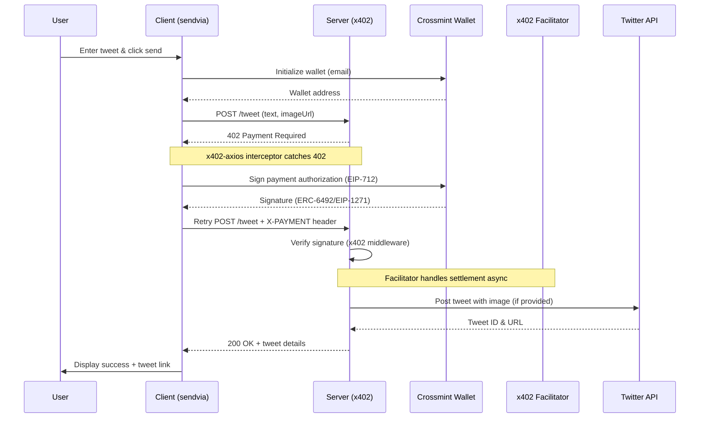

## x402 Tweet Agent (Crossmint Wallets)

A tweet agent that sends tweets on X/Twitter for payment using the x402 payment protocol. The client uses Crossmint smart wallets to sign payment authorizations (EIP-712), and the server uses x402 middleware to verify signatures. Settlement is handled by an external facilitator. Supports optional image attachments.

<div align="center">

[](https://youtu.be/NlAtssVK5Rg)

Watch the video walkthrough of this codebase [here](https://youtu.be/NlAtssVK5Rg)

</div>


### What it does

**Server** (Express + x402-express):
- Protected `/tweet` endpoint requiring payment ($1 USDC by default)
- Uses x402 middleware to verify EIP-712 payment signatures
- Posts tweet (with optional image) via Twitter API v2 after payment verification
- Validates tweet text (280 character limit)
- External facilitator handles on-chain settlement

**Client** (Next.js + x402-axios):
- Creates Crossmint smart wallet for user (via email)
- Wallet deployment check and optional on-chain deployment
- Uses x402-axios interceptor to handle 402 payment flows automatically
- Signs payment authorizations with Crossmint wallet (ERC-6492/EIP-1271)
- Includes localStorage persistence for configuration
- Comprehensive input validation and accessibility features

### Payment Flow



### Prerequisites

- Node.js 18+
- Twitter Developer Account with API v2 access (Read and Write permissions)
- Crossmint API key (server-side `sk_*` key for API key signer)
- User email for wallet association

### Install

```bash
# Install server dependencies
npm install

# Install client dependencies
cd sendvia && npm install
```

### Configure

Copy `.env.example` to `.env` and set:

**Required:**
- `MERCHANT_ADDRESS`: Wallet address to receive payments
- `TWITTER_CONSUMER_KEY`, `TWITTER_CONSUMER_SECRET`
- `TWITTER_ACCESS_TOKEN`, `TWITTER_ACCESS_TOKEN_SECRET`

**Optional:**
- `X402_NETWORK`: Network for payments (default: `base-sepolia`)
- `PRICE_USDC`: Price per tweet in USDC (default: `1`)
- `PORT`: Server port (default: `10001`)
- `CORS_ORIGIN`: CORS origin (default: `*`)

**Client Configuration:**
- Crossmint API key entered in UI (persisted in localStorage)
- User email for wallet creation entered in UI
- Server URL defaults to `http://localhost:10001`

### Run

**Start the server:**
```bash
npm run server
# Server runs on http://localhost:10001
```

**Start the client:**
```bash
npm run sendvia
# Client runs on http://localhost:3000
```

**Usage:**
1. Open http://localhost:3000 in your browser
2. Enter Crossmint API key and user email
3. Click "Initialize Wallet" to create a Crossmint smart wallet
4. Enter tweet text (max 280 characters)
5. Optionally add an image URL
6. Click "Send Tweet (with x402 Payment)"
7. The x402 interceptor handles payment automatically
8. Tweet is posted after payment verification

**Expected flow:**
- Client requests `/tweet` endpoint
- Server returns 402 Payment Required
- x402-axios interceptor catches 402 and requests payment signature
- Crossmint wallet signs EIP-712 payment authorization
- Client retries request with signature in `X-PAYMENT` header
- Server verifies signature via x402 middleware
- Tweet is posted to Twitter
- External facilitator settles payment on-chain asynchronously

### Twitter API Setup

1. Create app at https://developer.x.com/en/portal/dashboard
2. **Important**: Set app permissions to "Read and Write"
3. **Important**: Apply for "Elevated" access if using Basic access level
4. Generate API keys and access tokens (after setting permissions)
5. Ensure your Twitter account has phone verification
6. Add credentials to your `.env` file

### Troubleshooting

**Signature verification failed:**
- Ensure Crossmint wallet is properly initialized
- Check that the network matches between client and server
- Verify merchant address in `.env` is correct
- Check browser console for x402 signer errors

**403 Permission Denied:**
- Check app has "Read and Write" permissions (not just "Read")
- Regenerate access tokens after changing permissions
- Verify you have "Elevated" access (Basic access has limitations)
- Ensure Twitter account is verified with phone number

**401 Authentication Failed:**
- Verify all 4 credentials are correct (consumer key/secret, access token/secret)
- Check for extra spaces or quotes in environment variables

**429 Rate Limit:**
- Wait before retrying (Twitter has rate limits)
- Consider implementing retry logic with backoff

### Architecture

**Key Files:**
- [`server-x402.js`](server-x402.js): Express server with x402 middleware and Twitter API
- [`sendvia/app/page.tsx`](sendvia/app/page.tsx): Next.js client with x402-axios integration
- [`sendvia/app/x402Adapter.ts`](sendvia/app/x402Adapter.ts): Crossmint to x402 signer adapter
- [`.env.example`](.env.example): Configuration template

**Legacy Files:**
- `server.js`: Original A2A direct-transfer implementation (deprecated)
- `sendvia/app/page-legacy.tsx`: Original A2A client (deprecated)

**Tech Stack:**
- Server: Express + x402-express + twitter-api-v2
- Client: Next.js + x402-axios + @crossmint/wallets-sdk
- Payment: x402 protocol with EIP-712 signatures
- Settlement: External facilitator (https://x402.org/facilitator)

## Known Issues

⚠️ **Crossmint Signature Issue**: Currently experiencing issues with API key signer + deployed wallets. See [KNOWN_ISSUES.md](./KNOWN_ISSUES.md) for details.

**Workaround**: Use pre-deployed wallets (skip the "Deploy Wallet" step) until the issue is resolved.