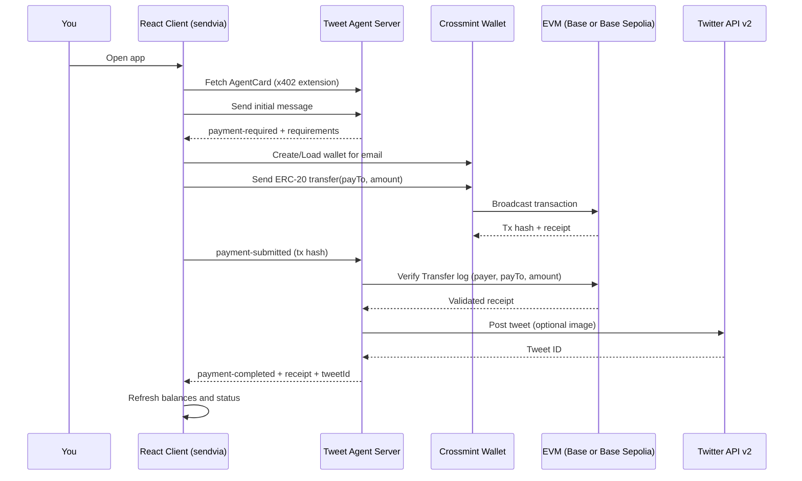

## A2A x402 Tweet Agent (direct-transfer + Crossmint)

A2A agent that sends tweets on X/Twitter for payment using the x402 payments extension and the `direct-transfer` scheme. The client uses Crossmint Wallets to pay USDC via an on-chain ERC‑20 transfer; the server verifies the transfer on-chain and posts the tweet via Twitter API v2 (optional image supported).

<div align="center">

[](https://www.youtube.com/watch?v=1NdFBqG1JVk)

Watch the video walkthrough of this codebase [here](https://www.youtube.com/watch?v=1NdFBqG1JVk)

</div>


### What it does

- Server (tweet agent):
  - Advertises the x402 extension with `direct-transfer` scheme
  - Requires tweet text (will error if not provided)
  - Accepts optional image URL for tweet attachment
  - Verifies ERC‑20 transfer by transaction receipt and Transfer event
  - Posts tweet (with optional image) via Twitter API v2 after successful payment
- Client (`sendvia` React app):
  - Uses Crossmint Wallets for the user (email) on the selected EVM chain
  - Fetches payment requirements and executes ERC‑20 `transfer(payTo, amount)`
  - Submits transaction hash via x402 `X-PAYMENT` payload
  - Displays balances (user and merchant) and logs

### Sequence Flow



### Prerequisites

- Node.js 18+
- Twitter Developer Account with API v2 access
- Crossmint API key (for Wallets) and a user email to associate the wallet

### Install

```bash
npm install
```

### Configure

Set environment variables (copy `.env.example` to `.env`):

**Server (required):**
- `RPC_URL`: EVM RPC endpoint (e.g. Base Sepolia)
- `MERCHANT_ADDRESS`: merchant wallet address (EOA to receive payment)
- `ASSET_ADDRESS`: USDC token address on the chosen network (default points to Base Sepolia)
- `X402_NETWORK`: `base` or `base-sepolia` (default: base-sepolia)
- `PRICE_USDC`: tweet price in USDC (decimal string, default: 1)
- `TWITTER_CONSUMER_KEY`, `TWITTER_CONSUMER_SECRET`, `TWITTER_ACCESS_TOKEN`, `TWITTER_ACCESS_TOKEN_SECRET`

Note: No `MERCHANT_PRIVATE_KEY` is required; the client performs the transfer and the server verifies it on-chain.

**Client (`sendvia`)**
- `CROSSMINT_API_KEY`: your Crossmint API key
- You will input the user email in the UI at runtime
- Server URL defaults to `http://localhost:10001`, configurable in the UI

### Run

1) Start the tweet agent server:
```bash
npm run server
# http://localhost:10001
```

2) Start the React client (`sendvia`):
```bash
npm run sendvia
# http://localhost:3000
```

3) In the client UI:
- Enter Crossmint API key and user email
- Enter the Tweet text and (optionally) an image URL
- Optionally change the server URL
- Click "Start Payment Flow" to pay and trigger tweeting

Expected:
- Payment requirements from server (direct-transfer)
- ERC‑20 transfer from Crossmint wallet to merchant
- Server verifies transaction and posts the tweet
- UI shows balances and the resulting tweet ID in logs

### Twitter API Setup

1. Create app at https://developer.x.com/en/portal/dashboard
2. **Important**: Set app permissions to "Read and Write"
3. **Important**: Apply for "Elevated" access if using Basic access level
4. Generate API keys and access tokens (after setting permissions)
5. Ensure your Twitter account has phone verification
6. Add credentials to your `.env` file

### Troubleshooting

**Direct-transfer verification failed:**
- Ensure the client paid the exact `maxAmountRequired` to `payTo`
- Confirm the token address (`ASSET_ADDRESS`) matches the token transferred
- Check `RPC_URL` correctness and network

**403 Permission Denied:**
- Check app has "Read and Write" permissions (not just "Read")
- Regenerate access tokens after changing permissions
- Verify you have "Elevated" access (Basic access has limitations)
- Ensure Twitter account is verified with phone number

**401 Authentication Failed:**
- Verify all 4 credentials are correct (consumer key/secret, access token/secret)
- Check for extra spaces or quotes in environment variables

**429 Rate Limit:**
- Wait before retrying (Twitter has rate limits)
- Consider implementing retry logic with backoff

### Files

- `server.js`: tweet agent server with x402 direct-transfer verification and Twitter API integration
- `sendvia/`: React client using Crossmint Wallets
- `.env.example`: configuration template

Note: If `.env.example` is not present, create a `.env` file with the variables listed above.